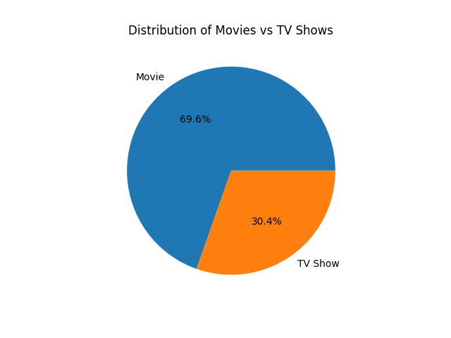
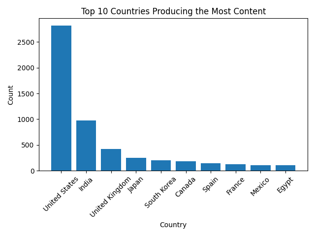

# Netflix Titles - Exploratory Data Analysis

Exploratory data analysis on the Netflix Titles dataset from Kaggle,
exploring content trends, ratings, genres, and more.

---

## Dataset
- **Source:** [Netflix Movies and TV Shows - Kaggle](https://www.kaggle.com/datasets/shivamb/netflix-shows)
- **Size:** 8,807 titles | 12 columns

---

## Questions Explored
1. How many Movies vs TV Shows are there?
2. Which countries produce the most content?
3. What are the most common ratings?
4. What are the most common genres?
5. Which release years have the most content?
6. Which months have the most content added?
7. What are the most common durations?

---

## Key Findings
- **69.6%** of Netflix content is Movies, **30.4%** is TV Shows
- **United States** dominates production with 2,818 titles, followed by India (972)
- **TV-MA** is the most common rating with 3,207 titles
- **International Movies** is the most common genre
- **2018** was the peak year for content with 1,147 titles
- **July** is the most active month for adding content

---

## Visuals

---

## How to Run
1. Clone the repo
   git clone https://github.com/codexyz1/netflix-analysis.git

2. Install dependencies
   pip install -r requirements.txt

3. Open the notebook
   jupyter notebook netflix_analysis.ipynb

---

## Tools Used
- Python 3.13
- Pandas
- Matplotlib
- Seaborn
- Jupyter Notebook

---

## About Me
Hi, I'm Abdalla — a Computer Science student at UAEU interested in Data Analysis and AI integration.

- 🔗 [LinkedIn](https://www.linkedin.com/in/abdalla-al-awadhi-53338a221/)
- 🐙 [GitHub](https://github.com/codexyz1)